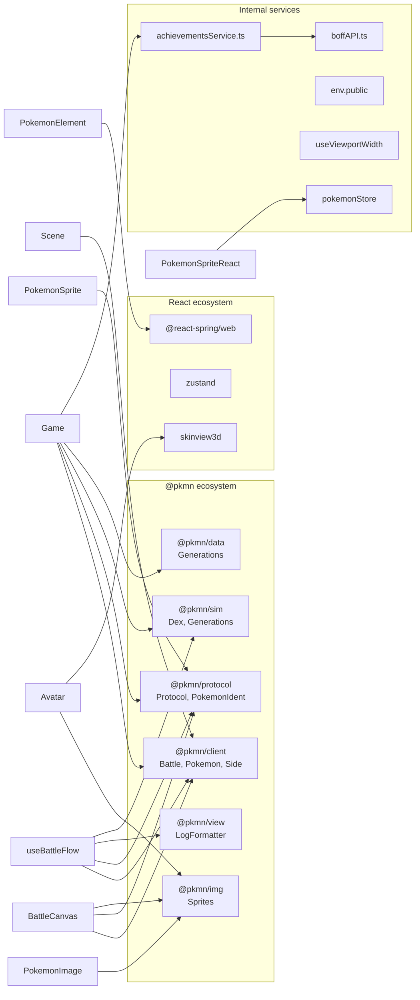
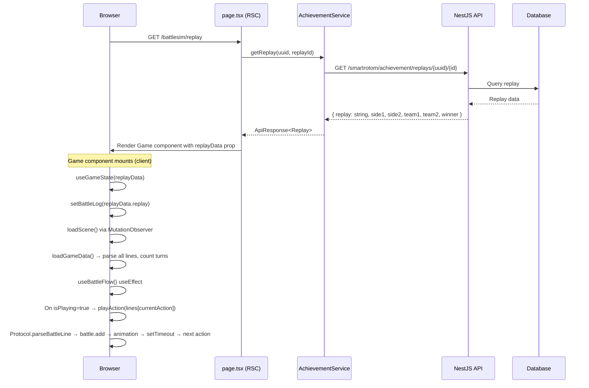
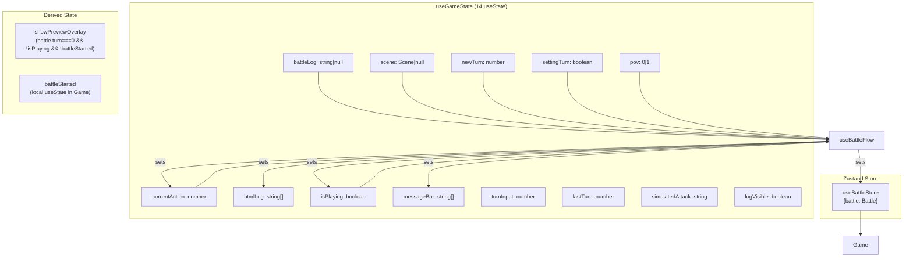

# Architectural Audit: `battlesim/replay` System

## 1. Executive Summary

The replay system is a Pokémon battle replay viewer built on the `@pkmn` library ecosystem. It loads battle log text (from an API or user paste), parses it line-by-line using the Pokémon Showdown protocol, and renders an animated 2D battle visualization with playback controls. The system suffers from significant architectural issues including duplicated class definitions, dead code, excessive state management complexity, and multiple performance anti-patterns.

**Key Metrics:**
- **Files in dependency chain:** 28 source files
- **Lines of code (direct):** ~2,800 (excluding `battle-animations-moves.ts` at ~39K)
- **External libraries:** 7 (`@pkmn/client`, `@pkmn/protocol`, `@pkmn/sim`, `@pkmn/data`, `@pkmn/view`, `@pkmn/img`, `@react-spring/web`, `zustand`, `skinview3d`)
- **Critical issues:** 8 | **High:** 12 | **Medium:** 15 | **Low:** 9

---

## 2. Full Architecture Overview

### 2.1 System Architecture Diagram

```mermaid
graph TB
    subgraph "Entry Points"
        P1["page.tsx<br/>(/battlesim/replay)"]
        P2["[name]/page.tsx<br/>(/battlesim/replay/:name)"]
        P3["page2.tsx<br/>(DEAD CODE - commented out)"]
    end

    subgraph "API Layer"
        AS["AchievementService"]
        API["boffAPI.ts<br/>(rotomGET)"]
        EXT["api.boffmedia.es<br/>(external)"]
    end

    subgraph "Game Component (Client)"
        G["Game.tsx"]
        RL["ReplayLoader<br/>(commented out)"]
    end

    subgraph "State Management"
        UGS["useGameState hook"]
        ZS["useBattleStore<br/>(Zustand)"]
        UBF["useBattleFlow hook"]
        UBA["useBattleActions hook"]
    end

    subgraph "Rendering Layer"
        BC["BattleCanvas"]
        PE["PokemonElement"]
        PI["PokemonImage"]
        PS["PokemonSprite (React)"]
        PD["PokemonDetail"]
        PT["PokemonTeam"]
        AV["Avatar"]
        HZ["Hazard"]
        PES["PokemonStatus"]
        BPS["BattlePreview"]
        BES["BattleEndScreen"]
    end

    subgraph "Animation Engine"
        SC["Scene (class)"]
        BKG["BattleBackground"]
        SE["SceneEffects"]
        PSS["PokemonSprite (Canvas)"]
        BMA["battle-animations-moves<br/>(~39K lines)"]
        BA["battle_animations.ts<br/>(BattleEffects)"]
        AQ["AnimationQueue"]
        BACT["battleActions.ts"]
    end

    subgraph "Utilities"
        VU["viewUtils"]
        BU["battleUtils"]
        GD["game.ts"]
    end

    subgraph "Shared Dependencies"
        VP["useViewportWidth"]
        ENV["env.public"]
        ST["pokemonStore (Zustand)"]
        L["Loading component"]
        MS["MinecraftSkin"]
    end

    P1 -->|"replayData"| G
    P2 -->|"battleName"| G
    P1 --> AS --> API --> EXT

    G --> UGS --> ZS
    G --> UBF --> UBA
    G --> BC
    G --> BACT

    BC --> PE --> PI
    BC --> PS
    BC --> PD
    BC --> PT
    BC --> AV
    BC --> HZ
    BC --> PES
    BC --> BPS
    BC --> BES

    UBF --> SC --> BKG
    SC --> SE
    SC --> PSS
    SC --> BMA
    SC --> BA
    SE --> BA
    SE --> BMA
    PSS --> AQ

    UBF --> BACT
    UBA --> BACT

    G --> VU
    BC --> VU
    G --> VP
    BC --> VP
    PS --> ST
    AV --> MS
```



### 2.2 Routing Configuration

| Route | File | Type | Description |
|---|---|---|---|
| `/battlesim/replay` | `page.tsx` | Server Component (async) | Loads replay from API with hardcoded UUID/replayId |
| `/battlesim/replay/[name]` | `[name]/page.tsx` | Server Component | Loads replay by battle name (default: `medalla_doku`) |
| `/battlesim/replay/page2` | `page2.tsx` | Dead code | Entirely commented out; was an earlier prototype |

---

## 3. File-by-File Analysis

### 3.1 Entry Points

#### `page.tsx` — Primary Entry
- **Path:** `apps/web/src/app/battlesim/replay/page.tsx`
- **Type:** Next.js Server Component (`force-dynamic`)
- **Purpose:** Fetches replay data server-side and passes to `Game` client component
- **Issues:**
  - Hardcoded UUID `67d9b543-5ac9-41e1-a8a5-20d7689e24a4` and replay ID `62` — **no dynamic routing**
  - Creates unused `Battle` instance at module scope (line 11) — **memory leak on server**
  - Imports `Pokemon` and `Side` but never uses them

#### `[name]/page.tsx` — Dynamic Route
- **Path:** `apps/web/src/app/battlesim/replay/[name]/page.tsx`
- **Type:** Server Component (not async)
- **Purpose:** Renders `Game` with a battle name parameter
- **Issues:**
  - Creates unused `Battle` instance at module scope (line 7)
  - `params` is typed but not awaited (Next.js 16 requires `await params`)
  - Passes `battleName` but `Game` component defaults to `'medalla_doku'` regardless

#### `page2.tsx` — Dead Code
- **Path:** `apps/web/src/app/battlesim/replay/page2.tsx`
- **Status:** Entirely commented out inside `/* */`
- **Action:** Delete this file

### 3.2 Core Components

#### `Game.tsx` — Main Orchestrator
- **Path:** `apps/web/src/app/battlesim/replay/_components/Game.tsx`
- **Type:** Client Component (`"use client"`)
- **Purpose:** Top-level replay component; manages replay loading, state, playback, and rendering
- **Props:** `{ battleName?: string, replayData?: ReplayData }`
- **Key behaviors:**
  - Initializes game state via `useGameState`
  - Sets up battle flow control via `useBattleFlow`
  - Renders `BattleCanvas` + `ReplayControls`
  - Shows debug info in development mode
- **Issues:**
  - `ReplayLoader` sub-component is defined but commented out (lines 122-126) — dead code
  - `simulateAttack` function is exposed but appears to be a debug tool left in production
  - Passes 14 props to `ReplayControls` — excessive prop drilling

#### `BattleCanvas.tsx` — Battle Renderer
- **Path:** `apps/web/src/app/battlesim/_components/BattleCanvas.tsx`
- **Purpose:** Renders the battle field with Pokémon sprites, status bars, hazards, and overlays
- **Issues:**
  - `messageBar!` non-null assertion (line 133) — crashes if undefined
  - `battle.pokemonControlled` guard (line 70) — returns `<Loading/>` which may never resolve for replays
  - Renders trick room overlay **unconditionally** (line 181-187) — always visible regardless of game state

#### `ReplayControls.tsx` — Playback Controls
- **Path:** `apps/web/src/app/battlesim/replay/_components/ReplayControls.tsx`
- **Purpose:** Play/pause, turn navigation, POV switch, log toggle, attack simulation
- **Issues:**
  - `canvasWidth === 0` returns null — flash of nothing on SSR
  - Simulate Attack is a debug feature exposed in production UI

#### `BattlePreview.tsx` — Pre-Battle Overlay
- **Path:** `apps/web/src/app/battlesim/_components/BattlePreview.tsx`
- **Purpose:** Shows VS screen with player avatars before battle starts
- **Note:** Uses `styled-jsx` which may conflict with Tailwind

#### `BattleEndScreen.tsx` — Victory/Defeat Screen
- **Path:** `apps/web/src/app/battlesim/_components/BattleEndScreen.tsx`
- **Purpose:** Displays winner when replay reaches the `|win|` action

### 3.3 State Management Layer

#### `useGameState.tsx` — Central State Hook
- **Path:** `apps/web/src/app/battlesim/_hooks/useGameState.tsx`
- **Purpose:** Creates and manages all battle state
- **State sources:**
  - **Zustand store** (`useBattleStore`): `battle` instance
  - **Local useState**: `battleLog`, `currentAction`, `scene`, `htmlLog`, `isPlaying`, `messageBar`, `turnInput`, `newTurn`, `settingTurn`, `lastTurn`, `simulatedAttack`, `logVisible`, `pov`
- **Issues:**
  - **Dual state pattern**: `battle` is in Zustand but also passed through prop drilling — inconsistent ownership
  - `loadScene()` uses `MutationObserver` to wait for `#game` element — fragile DOM coupling
  - Falls back to fetching from `https://api.boffmedia.es/smartrotom/combates/booststera.txt` if no replay data — **hardcoded external URL**
  - `loadGameData()` counts turns by string matching `|turn|` — off-by-one risk
  - `useBattleStore` creates a `Battle` at module load time — singleton issue if multiple replays

#### `useBattleFlow.tsx` — Playback Engine
- **Path:** `apps/web/src/app/battlesim/_hooks/useBattleFlow.tsx`
- **Purpose:** Drives the replay forward by processing battle log lines one at a time
- **Key flow:**
  1. `useEffect` on `[currentAction, isPlaying]` triggers `playAction()`
  2. `playAction()` parses line → updates battle state → calls `performAction()` for animation
  3. `performAction()` dispatches to `battleActions` handlers with setTimeout delays
  4. Advances `currentAction` after delay
- **Issues:**
  - **Promise anti-pattern**: `new Promise<void>(async (resolve) => {...})` (line 179) — known as the "explicit constructor anti-pattern"
  - `copyBattle()` does shallow `Object.assign` — **does not deep-copy** the Battle object, causing shared mutable state
  - `handleTurnChange()` creates a **new Battle instance** for every turn change — expensive
  - `formatter` created on every render (line 29) — `new LogFormatter('p1', battle)` is not memoized
  - Race condition: if `isPlaying` changes rapidly, multiple `playAction` calls can overlap

#### `useBattleActions.tsx` — Animation Dispatch
- **Path:** `apps/web/src/app/battlesim/_hooks/useBattleActions.tsx`
- **Purpose:** Maps protocol actions to animation functions
- **Issues:**
  - `getRelativeIdent()` is duplicated between this file and `useBattleFlow.tsx`
  - All timeouts use `scene?.acceleration || 1` — no memoization of the divisor

### 3.4 Animation Engine

#### `Scene.ts` — Main Scene Manager
- **Path:** `apps/web/src/app/battlesim/_utils/Scene.ts`
- **Purpose:** Manages battle visualization, coordinates animations
- **Issues:**
  - **TWO DIFFERENT `Scene` classes exist**: one in `_utils/Scene.ts` and another in `_utils/battle_animations.ts`
  - The `_utils/Scene.ts` version delegates to `BattleBackground`, `SceneEffects`, and `PokemonSprite` helper classes
  - The `battle_animations.ts` version is a monolithic class with all animation logic inline
  - Both are imported by different parts of the codebase — **undefined behavior at runtime**

#### `battle_animations.ts` — Monolithic Animation Module (652 lines)
- **Path:** `apps/web/src/app/battlesim/_utils/battle_animations.ts`
- **Purpose:** Contains `BattleEffects`, `Scene` (duplicate), `PokemonSprite` (duplicate), `BG` classes
- **Issues:**
  - Duplicates `Scene`, `PokemonSprite` classes that also exist in separate files
  - `Scene.animsTest` property is poorly named and only contains `pokeball` animation
  - `showEffect` manipulates DOM directly via `document.createElement('img')` — bypasses React

#### `battle-animations-moves.ts` — Move Animation Definitions (~39,097 lines)
- **Path:** `apps/web/src/app/battlesim/_utils/battle-animations-moves.ts`
- **Purpose:** Defines animation sequences for every battle move and status effect
- **Structure:** Two exports: `BattleOtherAnims` and `BattleMoveAnims` (both are large dictionaries)
- **Issues:**
  - Single file of ~39K lines — **extremely large**, poor maintainability
  - Licensed from Pokémon Showdown (MIT for animation engine) — attribution present
  - `BattleOtherAnims` contains `faint` and `switch` which reference `data.startingPosition` but the data shape varies per call site

#### `PokemonSprite.ts` (Canvas) — Sprite Animation Controller
- **Path:** `apps/web/src/app/battlesim/_utils/PokemonSprite.ts`
- **Purpose:** Manages individual Pokémon sprite positioning and animation queue
- **Issues:**
  - Constructor throws if element not found (line 29) — no graceful fallback
  - `performAnimation()` pushes to `scene.currentAnimations` but removal is by index shift — fragile
  - `clearElement()` sets `borderColor = 'white'` — debug artifact

#### `SceneEffects.ts` — Visual Effects
- **Path:** `apps/web/src/app/battlesim/_utils/SceneEffects.ts`
- **Purpose:** Shows popups, plays effects, manages effect DOM elements
- **Issues:**
  - `console.log('showEffect', ...)` on line 111 — debug logging in production
  - Creates DOM elements directly — memory leak if animation interrupted before cleanup

#### `AnimationQueue.ts` — Queue Manager
- **Path:** `apps/web/src/app/battlesim/_utils/AnimationQueque.ts`
- **Note:** Filename has typo "Queque" instead of "Queue"
- **Status:** Appears unused — `Scene` and `PokemonSprite` have their own inline queue logic
- **Action:** Delete or integrate

#### `BattleBackground.ts` — Background Effects
- **Path:** `apps/web/src/app/battlesim/_utils/BattleBackground.ts`
- **Status:** Stub class with empty methods — all implementations are `// Implementation to be added`
- **Action:** Either implement or remove

### 3.5 Rendering Components

#### `PokemonElement.tsx` — Battle Pokémon
- Uses `@react-spring/web` for animations but the `animated.div` has no animated properties — **unnecessary dependency**

#### `PokemonImage.tsx` — Sprite Renderer
- Accesses `window.innerWidth` directly in render — breaks SSR, causes hydration mismatch
- Hardcoded fallback URL `http://boffmedia.es/...` — **insecure HTTP**

#### `PokemonSprite.tsx` (React) — Thumbnail Sprite
- Uses `usePokemonStore` Zustand store — pulls in global state for a small sprite component
- `useEffect` dependency on `pokemon?.species?.num` — misses forme changes

#### `PokemonStatus.tsx` — HP/Status Display
- Imports `test.css` — test stylesheet in production
- `getScaleMultiplier()` called on every render without memoization

#### `Avatar.tsx` — Trainer Avatars
- Multiple `console.log` calls (lines 13-16) — debug output in production
- Loads from `crafatar.com` — external service dependency with no fallback

#### `PokemonDetail.tsx` — Hover Card
- 328 lines — too large for a single component
- Calculates stats on every render — should be memoized
- `showDetailedInfo` logic is good but underused

### 3.6 Utility Files

#### `viewUtils.ts` — Layout Constants
- **Path:** `apps/web/src/app/battlesim/_utils/viewUtils.ts`
- Contains position maps for all game types (singles, doubles, triples, raid, horde)
- `getOffset()` is called frequently — no caching

#### `battleUtils.ts` — Battle Helpers
- Single function `countActions` — used by `BattleCanvas` for end-screen logic
- Duplicated as inline lambda in `useGameState.tsx`

#### `game.ts` — Log Generator
- `generateLog()` function — appears unused by the replay system
- Uses `@pkmn/sim` imports (`PRNG`, `TeamValidator`, etc.) that are not used
- **Action:** Remove or document purpose

### 3.7 API Service Layer

#### `achievementsService.ts`
- `getReplay(uuid, replayId)` → `GET /smartrotom/achievement/replays/{uuid}/{replayId}`
- Returns `ApiResponse<Replay>` with replay text and metadata

#### `boffAPI.ts`
- Generic HTTP client wrapping `fetch`
- `rotomGET` prefixes `/smartrotom` to all SmartRotom endpoints
- No retry logic, no caching, no request deduplication

### 3.8 Type Definitions

#### `types.ts`
- Defines `ScenePos`, `AnimationData`, `StartingPosition`, `AnimationProps`, `ReplayData`
- **Module augmentation** adds `winner?: string` to `@pkmn/client` Battle — **global side effect**

---

## 4. Dependency Graph



---

## 5. Data Flow Architecture

### 5.1 Data Lifecycle



### 5.2 State Flow Diagram



---

## 6. Replay Execution Lifecycle

### 6.1 Initialization Sequence

```
1. Page loads (RSC) → fetches replay data from API
2. Game component mounts (client)
3. useGameState(replayData):
   a. Sets battleLog from replayData.replay
   b. loadScene(): MutationObserver waits for #game element → creates Scene
   c. loadGameData(): Parses all lines, counts turns, sets lastTurn
4. useBattleFlow() initializes:
   a. Creates LogFormatter instance
   b. Creates useBattleActions instance
5. BattleCanvas renders with battle at turn 0
6. BattlePreview overlay shown (showPreviewOverlay = true)
```

### 6.2 Playback Sequence

```
1. User clicks Play → setIsPlaying(true) → setBattleStarted(true)
2. useEffect([currentAction, isPlaying]) fires
3. playAction(battleLog[currentAction]):
   a. Protocol.parseBattleLine(line) → {args, kwArgs}
   b. formatter.formatHTML(args, kwArgs) → html string
   c. battle.add(args, kwArgs) → updates @pkmn Battle state
   d. updateBattleLog() → appends to htmlLog, sets messageBar
   e. getParams() → resolves animation data (damage calc, switch anim, etc.)
   f. performAction() → dispatches to appropriate battleActions handler
   g. setTimeout(delay) → setCurrentAction(currentAction + 1)
4. Next useEffect cycle → playAction(next line)
5. Continues until:
   a. All lines processed → setIsPlaying(false)
   b. User pauses
   c. User navigates to different turn
```

### 6.3 Turn Navigation

```
setCurrentTurn(targetTurn):
1. If playing → setSettingTurn(true), setNewTurn(targetTurn)
2. handleTurnChange():
   a. Creates NEW Battle instance
   b. Replays ALL lines from start to target turn
   c. For each line: battle.add(line) + formatHTML
   d. Sets battle to the new instance
   e. Resets currentAction
3. If targetTurn === lastTurn + 1 → processes ALL lines including win action
```

**Critical Issue:** Turn navigation replays the entire battle from scratch every time — O(n) where n = total lines.

---

## 7. Performance Findings

### Critical

| # | Issue | Root Cause | Impact | File:Line | Fix |
|---|---|---|---|---|---|
| P1 | **Turn navigation replays entire battle** | `handleTurnChange()` creates new `Battle` and replays all lines | O(n) per turn change, freezes UI on long battles | `useBattleFlow.tsx:51-108` | Cache battle snapshots at each turn boundary |
| P2 | **copyBattle() is shallow copy** | `Object.assign(newBattle, battle)` doesn't deep-copy nested objects | Shared mutable state between original and copy, causing state corruption | `useBattleFlow.tsx:322-325` | Use proper serialization or `structuredClone` |
| P3 | **39K line animation file** | All move animations in single file | Huge bundle, slow parse time, poor tree-shaking | `battle-animations-moves.ts` | Split into per-generation or per-category chunks |
| P4 | **Duplicate Scene/PokemonSprite classes** | Two different implementations exist in different files | Undefined which is used at runtime, double bundle size | `Scene.ts` + `battle_animations.ts` | Consolidate to single implementation |

### High

| # | Issue | Root Cause | Impact | File:Line | Fix |
|---|---|---|---|---|---|
| P5 | `formatter` recreated every render | `new LogFormatter('p1', battle)` in hook body without useMemo | GC pressure on every render cycle | `useBattleFlow.tsx:29` | `useMemo(() => new LogFormatter('p1', battle), [battle])` |
| P6 | `console.log` in Avatar | Debug logging in production render path | Console spam, minor perf hit | `Avatar.tsx:13-16` | Remove |
| P7 | `console.log` in SceneEffects | Debug logging in animation path | Console spam per animation | `SceneEffects.ts:111` | Remove |
| P8 | `window.innerWidth` in render | `PokemonImage` accesses window during render | SSR hydration mismatch, forced reflow | `PokemonImage.tsx:20` | Use `useViewportWidth` hook |
| P9 | `getScaleMultiplier()` called per render | No memoization in components using it | Multiple forced reflows per render | `PokemonStatus.tsx`, `Avatar.tsx`, etc. | Memoize in a hook |
| P10 | `MutationObserver` for scene init | Waits for DOM element to exist | Race condition if element already exists | `useGameState.tsx:130-143` | Use ref callback instead |
| P11 | `htmlLog.map` with `dangerouslySetInnerHTML` | New array allocation on every log append, no virtualization | Memory grows linearly, DOM bloat | `Game.tsx:182-185` | Use virtualized list |
| P12 | `battleLog.split('\n')` called repeatedly | Same string split on every action/turn change | Wasted CPU on long replays | `useBattleFlow.tsx:36,52` | Split once and cache |

### Medium

| # | Issue | Root Cause | Impact | Fix |
|---|---|---|---|---|
| P13 | `@react-spring/web` imported but unused | `animated.div` has no animated props | Bundle bloat (~15KB) | Remove dependency |
| P14 | `skinview3d` imported transitively | `Avatar` → `MinecraftSkin` → `skinview3d` | Heavy 3D library loaded for 2D sprites | Lazy load or use static images |
| P15 | No request deduplication on API calls | `AchievementService.getReplay` called without dedup | Duplicate requests in strict mode | Use React Query or SWR |
| P16 | `usePokemonStore` in PokemonSprite | Full Zustand store for a thumbnail | Unnecessary re-renders from store changes | Pass sprite URL as prop |
| P17 | `BattleEffects` loaded eagerly | 60+ effect definitions imported at module level | Slow initial parse | Lazy load or code-split |

---

## 8. Security Findings

| # | Severity | Issue | File:Line | Fix |
|---|---|---|---|---|
| S1 | **High** | `dangerouslySetInnerHTML` with battle log HTML | `Game.tsx:183`, `BattleCanvas.tsx:135` | Sanitize HTML with DOMPurify before rendering |
| S2 | **Medium** | Hardcoded HTTP URL for sprite fallback | `PokemonImage.tsx:44` | Change to HTTPS |
| S3 | **Medium** | No input validation on replay text pasted into `ReplayLoader` | `Game.tsx:20-42` | Validate replay format before processing |
| S4 | **Low** | External dependency on `crafatar.com` for avatars | `Avatar.tsx:61`, `BattlePreviewAvatar.tsx:89` | Add fallback image |
| S5 | **Low** | External dependency on `play.pokemonshowdown.com` for cries | `useBattleFlow.tsx:277` | Self-host or add fallback |
| S6 | **Low** | Module augmentation of `@pkmn/client` Battle type | `types.ts:57-60` | Use composition instead |

---

## 9. Code Quality Findings

### 9.1 Dead Code

| File | Status | Action |
|---|---|---|
| `page2.tsx` | Entirely commented out | Delete |
| `AnimationQueue.ts` | Unused by any import chain | Delete |
| `BattleBackground.ts` | Stub with empty methods | Delete or implement |
| `game.ts` (`generateLog`) | Not imported by replay system | Verify usage elsewhere or delete |
| `LogComponent.tsx` | Empty component | Delete |
| `ReplayLoader` in `Game.tsx` | Commented out usage (lines 122-126) | Remove or re-enable |
| `BattleStateDebugger.tsx` | Not imported by any active file | Delete or move to dev-only |

### 9.2 Duplicate Logic

| Logic | Locations | Fix |
|---|---|---|
| `getRelativeIdent()` | `useBattleFlow.tsx:305-311` + `useBattleActions.tsx:51-57` | Extract to shared utility |
| `countActions()` | `battleUtils.ts` + inline in `useGameState.tsx:145-147` | Use single implementation |
| `getParticipantName()` | `BattleCanvas.tsx:26-36` + `BattleEndScreen.tsx:4-14` + `BattlePreview.tsx:8-18` | Extract to utility |
| `Scene` class | `_utils/Scene.ts` + `_utils/battle_animations.ts` | Consolidate |
| `PokemonSprite` class | `_utils/PokemonSprite.ts` + `_utils/battle_animations.ts:539-652` | Consolidate |

### 9.3 Anti-Patterns

| Pattern | Location | Issue |
|---|---|---|
| **Explicit Promise constructor anti-pattern** | `useBattleFlow.tsx:179` | `new Promise<void>(async (resolve) => {...})` — errors are swallowed |
| **Module-scope Battle instantiation** | `page.tsx:11`, `[name]/page.tsx:7` | Server-side singleton shared across requests |
| **Non-null assertion** | `BattleCanvas.tsx:133` | `messageBar!` crashes if undefined |
| **String-based action dispatch** | `useBattleFlow.tsx:213-246` | Large switch statement should be a strategy map |
| **Direct DOM manipulation** | `SceneEffects.ts`, `battle_animations.ts` | Bypasses React reconciliation |
| **Console.log in production** | 6+ locations | Should use logger or be removed |
| **Typed `as any`** | 15+ locations | Defeats TypeScript safety |

---

## 10. Technical Debt Inventory

| Item | Priority | Effort | Description |
|---|---|---|---|
| Consolidate duplicate classes | Critical | 3-5 days | Scene, PokemonSprite exist in two files each |
| Split `battle-animations-moves.ts` | High | 2-3 days | 39K lines needs modular decomposition |
| Replace shallow copy with proper clone | Critical | 1 day | `copyBattle()` causes state corruption |
| Add HTML sanitization | High | 0.5 days | `dangerouslySetInnerHTML` with unsanitized content |
| Remove dead code | Low | 0.5 days | 7 files/sections identified |
| Extract shared utilities | Medium | 1 day | `getRelativeIdent`, `getParticipantName`, `countActions` |
| Cache battle snapshots for turn nav | High | 2-3 days | Avoid O(n) replay on every turn change |
| Memoize expensive computations | Medium | 1 day | `formatter`, `getScaleMultiplier`, position calculations |
| Replace MutationObserver with ref | Medium | 0.5 days | More reliable scene initialization |
| Add error boundaries | Medium | 1 day | No error boundaries in the replay tree |
| Remove `@react-spring/web` dependency | Low | 0.5 days | Unused in practice |
| Remove `skinview3d` from critical path | Medium | 1 day | Lazy load NPC skins |
| Add `test.css` cleanup | Low | 0.5 days | Test stylesheet imported in production |

---

## 11. Refactoring Recommendations

### Phase 1: Critical Fixes (1-2 days)

1. **Fix `copyBattle()`** — Use `structuredClone` or implement proper serialization
2. **Remove module-scope Battle instantiation** from `page.tsx` and `[name]/page.tsx`
3. **Sanitize HTML** — Add DOMPurify before `dangerouslySetInnerHTML`
4. **Fix Promise anti-pattern** in `useBattleFlow.tsx:179`

### Phase 2: Architecture Cleanup (1 week)

5. **Consolidate Scene/PokemonSprite** — Single source of truth for each class
6. **Split animation file** — Per-type modules (`physical.ts`, `special.ts`, `status.ts`, etc.)
7. **Cache turn snapshots** — Store `Battle` state at turn boundaries for O(1) seeking
8. **Extract shared utilities** — `battleUtils.ts` with `getRelativeIdent`, `getParticipantName`, `countActions`

### Phase 3: Performance Optimization (1 week)

9. **Memoize formatters and calculators** — `useMemo` for `LogFormatter`, `getScaleMultiplier`
10. **Virtualize log list** — Use `react-window` or similar for `htmlLog` rendering
11. **Split and lazy-load animations** — Dynamic imports for `BattleMoveAnims`
12. **Remove unused dependencies** — `@react-spring/web`, `skinview3d` (lazy load)

### Phase 4: Developer Experience (3-5 days)

13. **Remove all console.log** from production code
14. **Remove dead code** (7 files/sections)
15. **Replace `as any`** with proper types
16. **Add error boundaries** around replay tree
17. **Remove `test.css` import** from `PokemonStatus.tsx`

---

## 12. Prioritized Action Plan

### Critical (Do Immediately)
- Fix `copyBattle()` shallow copy → state corruption risk
- Sanitize `dangerouslySetInnerHTML` → XSS vulnerability
- Remove module-scope `Battle` instantiation → server memory leak

### High (This Sprint)
- Consolidate duplicate `Scene`/`PokemonSprite` classes
- Cache battle snapshots for turn navigation
- Split 39K-line animation file
- Remove console.log statements
- Fix Promise anti-pattern

### Medium (Next Sprint)
- Extract shared utility functions
- Memoize expensive computations
- Replace MutationObserver with ref
- Add error boundaries
- Lazy-load heavy dependencies
- Remove unused `@react-spring/web`

### Low (Backlog)
- Delete 7 dead code files
- Remove `test.css` import
- Replace `as any` types
- Add request deduplication for API calls
- Self-host external assets (crafatar, PS cries)

---

## 13. Unknowns & Assumptions

| Item | Status | Notes |
|---|---|---|
| `game.ts` (`generateLog`) | Unknown usage | Not imported by replay chain; may be used elsewhere |
| `BattleStateDebugger.tsx` | Unknown usage | No active imports found; may be referenced in removed code |
| `page2.tsx` routing | Unknown | Next.js may still expose this as a route despite being dead code |
| `@pkmn/client` `Battle.add()` behavior | Assumed | Assumed to mutate internal state; documentation sparse |
| `LogFormatter` output safety | Assumed | Assumed to produce safe HTML; no sanitization evidence |
| `Battle.pokemonControlled` in replay context | Unknown | May always be undefined for replays, causing permanent loading state |
| Multiple replay instances | Unknown | Zustand `useBattleStore` is singleton — unclear if multiple replays on same page would conflict |

---

## 14. Stakeholder Decisions

Decisions made during audit review (2026-05-31):

| Item | Decision | Notes |
|---|---|---|
| Replay page routing | **Dev tool for now** | Same for `booststera.txt` fallback — not production routes |
| Dead code files | **Keep, track only** | Do not delete; add tracking comments for future cleanup |
| Simulate Attack button | **Remove from UI** | Keep the function, hide button unless `NODE_ENV=development` |
| 39K animation file | **Leave for now** | Add to post-checks list; split in a future phase |
| `@react-spring/web` | **Remove** | Only import is in `PokemonElement.tsx` — `useSpring`/`useTransition` never called, `animated.div` has no animated props. Confirmed dead dependency. |
| BattlePreview overlay | **Keep** | Nice UX before replay starts |
| Named replay route `[name]` | **Keep as placeholder** | Rename for clarity if needed |
| ReplayLoader | **Re-enable and fix** | Let users paste PS replay text directly |
| `copyBattle()` fix | **Fix aggressively** | Use `structuredClone`, fix correctness first |
| Task management | **BookStack plan_goal** | Create formal plan with draft tasks |

---

## 15. Task Breakdown

### Phase 1: Critical Safety Fixes (Estimated: 2-3 days)

#### Task 1.1 — Fix `copyBattle()` shallow copy
- **Priority:** Critical
- **Files:** `useBattleFlow.tsx:322-325`
- **Problem:** `Object.assign` creates shared mutable state between battle copies
- **Fix:** Replace with `structuredClone()` or implement deep copy via `Battle` serialization
- **Verification:** Run a replay, seek to different turns, verify no state corruption
- **Risk:** May change animation timing — test thoroughly

#### Task 1.2 — Sanitize `dangerouslySetInnerHTML`
- **Priority:** Critical
- **Files:** `Game.tsx:183`, `BattleCanvas.tsx:135`
- **Problem:** Raw HTML from `@pkmn/view` `LogFormatter` rendered without sanitization
- **Fix:** Add `DOMPurify` (or equivalent) before rendering; sanitize `htmlLog` entries and `messageBar`
- **Verification:** Run replay, verify all log messages render correctly, test with crafted input
- **Risk:** Low — DOMPurify preserves safe HTML

#### Task 1.3 — Remove module-scope `Battle` instantiation
- **Priority:** Critical
- **Files:** `page.tsx:11`, `[name]/page.tsx:7`
- **Problem:** `new Battle(...)` at module scope creates server-side singleton shared across requests
- **Fix:** Move instantiation inside the component function body or remove if unused
- **Verification:** Load replay page, verify battle renders correctly
- **Risk:** Low — the instances appear unused

#### Task 1.4 — Fix Promise anti-pattern
- **Priority:** High
- **Files:** `useBattleFlow.tsx:179`
- **Problem:** `new Promise<void>(async (resolve) => {...})` swallows errors
- **Fix:** Restructure to use async/await directly or proper Promise chain
- **Verification:** Trigger error conditions, verify errors propagate correctly
- **Risk:** Low — behavioral no-op if done correctly

### Phase 2: UI Cleanup (Estimated: 1 day)

#### Task 2.1 — Hide Simulate Attack in production
- **Priority:** Medium
- **Files:** `Game.tsx:162-165`, `ReplayControls.tsx:76-87`
- **Problem:** Debug tool exposed in production UI
- **Fix:** Wrap simulate attack button + input in `{env.NODE_ENV === 'development' && ...}`
- **Verification:** Verify button hidden in production build, visible in dev
- **Risk:** None

#### Task 2.2 — Remove console.log statements
- **Priority:** Medium
- **Files:** `Avatar.tsx:13-16`, `SceneEffects.ts:111`, `useBattleFlow.tsx:78`, `PokemonImage.tsx`, `boffAPI.ts:35`
- **Problem:** Debug logging in production render/animation paths
- **Fix:** Remove all `console.log` calls; keep `console.error` for actual errors
- **Verification:** Run replay, check browser console is clean
- **Risk:** None

#### Task 2.3 — Remove `test.css` import
- **Priority:** Low
- **Files:** `PokemonStatus.tsx:3`
- **Problem:** Test stylesheet imported in production component
- **Fix:** Remove import; verify styles still work (likely unused CSS)
- **Verification:** Check PokemonStatus renders correctly
- **Risk:** Low

### Phase 3: Re-enable ReplayLoader (Estimated: 1-2 days)

#### Task 3.1 — Uncomment and fix ReplayLoader
- **Priority:** Medium
- **Files:** `Game.tsx:16-75, 122-126`
- **Problem:** ReplayLoader component exists but usage is commented out
- **Fix:**
  1. Uncomment the early return guard
  2. Ensure `onReplayLoad` callback properly initializes state
  3. Add basic replay format validation
  4. Add loading state feedback
- **Verification:** Paste a PS replay text, verify it loads and plays
- **Risk:** Medium — needs integration testing with various replay formats

#### Task 3.2 — Add replay text validation
- **Priority:** Medium
- **Files:** `Game.tsx` (ReplayLoader)
- **Problem:** No validation on pasted replay text
- **Fix:** Check for required protocol lines (`|player|`, `|start|`, `|turn|`) before accepting
- **Verification:** Test with valid/invalid inputs
- **Risk:** Low

### Phase 4: Architecture Consolidation (Estimated: 3-5 days)

#### Task 4.1 — Consolidate duplicate `Scene` class
- **Priority:** High
- **Files:** `_utils/Scene.ts`, `_utils/battle_animations.ts:293-536`
- **Problem:** Two different `Scene` implementations exist
- **Fix:**
  1. Identify which version is actually used at runtime (trace imports)
  2. Merge functionality into `_utils/Scene.ts`
  3. Remove duplicate from `battle_animations.ts`
  4. Update all imports
- **Verification:** Full replay playback test — all animation types
- **Risk:** High — animation system is fragile

#### Task 4.2 — Consolidate duplicate `PokemonSprite` class
- **Priority:** High
- **Files:** `_utils/PokemonSprite.ts`, `_utils/battle_animations.ts:539-652`
- **Problem:** Two different `PokemonSprite` implementations exist
- **Fix:** Same approach as Task 4.1 — merge into `_utils/PokemonSprite.ts`
- **Verification:** Sprite animations work for all action types
- **Risk:** High

#### Task 4.3 — Extract shared utility functions
- **Priority:** Medium
- **Files:** New file `_utils/replayUtils.ts`
- **Problem:** `getRelativeIdent()`, `getParticipantName()`, `countActions()` duplicated across files
- **Fix:**
  1. Create `_utils/replayUtils.ts`
  2. Move all shared functions there
  3. Update imports in `useBattleFlow.tsx`, `useBattleActions.tsx`, `BattleCanvas.tsx`, `BattleEndScreen.tsx`, `BattlePreview.tsx`, `battleUtils.ts`
- **Verification:** All components render correctly
- **Risk:** Low

### Phase 5: Performance (Estimated: 2-3 days)

#### Task 5.1 — Cache battle log lines
- **Priority:** High
- **Files:** `useBattleFlow.tsx`, `useGameState.tsx`
- **Problem:** `battleLog.split('\n')` called on every action and turn change
- **Fix:** Split once in `useGameState`, store as `string[]`, pass to `useBattleFlow`
- **Verification:** Profile before/after on a long replay
- **Risk:** Low

#### Task 5.2 — Memoize `LogFormatter`
- **Priority:** Medium
- **Files:** `useBattleFlow.tsx:29`
- **Problem:** `new LogFormatter('p1', battle)` created every render
- **Fix:** `useMemo(() => new LogFormatter('p1', battle), [battle])`
- **Verification:** Verify log formatting still works
- **Risk:** Low

#### Task 5.3 — Fix `PokemonImage` SSR hydration
- **Priority:** Medium
- **Files:** `PokemonImage.tsx:20`
- **Problem:** `window.innerWidth` accessed during render — breaks SSR
- **Fix:** Use `useViewportWidth` hook; accept viewport width as prop with default
- **Verification:** No hydration mismatch warnings in console
- **Risk:** Low

#### Task 5.4 — Memoize `getScaleMultiplier`
- **Priority:** Medium
- **Files:** `viewUtils.ts`, components using it
- **Problem:** Called on every render without caching — triggers layout reflow
- **Fix:** Create a `useScaleMultiplier()` hook that caches based on viewport width
- **Verification:** Profile reflows before/after
- **Risk:** Low

#### Task 5.5 — Replace MutationObserver with ref
- **Priority:** Medium
- **Files:** `useGameState.tsx:130-143`
- **Problem:** MutationObserver waits for `#game` DOM element — fragile
- **Fix:** Use React ref callback on the `#game` div; pass ref to `useGameState`
- **Verification:** Scene initializes correctly on first render
- **Risk:** Medium — needs careful timing

### Phase 6: Investigate & Decide (Estimated: 1 day)

#### Task 6.1 — Check `@react-spring/web` usage
- **Priority:** Low
- **Files:** Entire project
- **Problem:** Imported in `PokemonElement.tsx` but no animated properties used
- **Fix:** Search codebase for other usages; if none, remove dependency and import
- **Verification:** `pnpm build:web` succeeds, no visual regressions
- **Risk:** Low

#### Task 6.2 — Check `game.ts` and `BattleStateDebugger.tsx` usage
- **Priority:** Low
- **Files:** `game.ts`, `BattleStateDebugger.tsx`
- **Problem:** Unknown if used elsewhere in the project
- **Fix:** Search all imports; if unused, add `// TRACKED: dead code — candidate for deletion` comments
- **Verification:** Build succeeds
- **Risk:** None

#### Task 6.3 — Check `Battle.pokemonControlled` in replay context
- **Priority:** Medium
- **Files:** `BattleCanvas.tsx:70`
- **Problem:** Guard returns `<Loading/>` if `pokemonControlled` is falsy — may block replay rendering
- **Fix:** Test if this property is set during replay playback; if not, add replay-specific guard
- **Verification:** Replay loads without stuck on loading spinner
- **Risk:** Medium

### Phase 7: Future / Post-Checks (Backlog)

- Split `battle-animations-moves.ts` (~39K lines) into modular files
- Add error boundaries around replay tree
- Virtualize `htmlLog` rendering for long replays
- Lazy-load `skinview3d` and `battle-animations-moves.ts`
- Remove `skinview3d` from critical path (lazy load NPC skins)
- Replace `as any` type assertions with proper types
- Add request deduplication for API calls
- Self-host external assets (crafatar, PS cries)
- Add HTML sanitization for `LogFormatter` output
- Cache battle snapshots for O(1) turn seeking (eliminates O(n) replay)
- Delete tracked dead code files when confirmed unused

---

## 16. File Reference Index

All files in the replay dependency chain with their roles:

| File | Role | Status |
|---|---|---|
| `replay/page.tsx` | Entry point (RSC) | Dev tool |
| `replay/[name]/page.tsx` | Dynamic entry (RSC) | Placeholder |
| `replay/page2.tsx` | Dead code | Track for deletion |
| `replay/_components/Game.tsx` | Main orchestrator | Active |
| `replay/_components/ReplayControls.tsx` | Playback UI | Active |
| `replay/_components/ReplayControlsButton.tsx` | Button primitive | Active |
| `replay/_components/BattleStateDebugger.tsx` | Debug tool | Track for deletion |
| `_hooks/useGameState.tsx` | Central state | Active |
| `_hooks/useBattleFlow.tsx` | Playback engine | Active |
| `_hooks/useBattleActions.tsx` | Animation dispatch | Active |
| `_utils/Scene.ts` | Scene manager | Active (has duplicate) |
| `_utils/battle_animations.ts` | Effects + duplicate classes | Active (needs consolidation) |
| `_utils/battle-animations-moves.ts` | Move animations (39K) | Active (leave as-is) |
| `_utils/battleActions.ts` | Action handlers | Active |
| `_utils/viewUtils.ts` | Layout utilities | Active |
| `_utils/battleUtils.ts` | Battle helpers | Active |
| `_utils/game.ts` | Log generator | Unknown usage |
| `_utils/PokemonSprite.ts` | Sprite controller | Active (has duplicate) |
| `_utils/SceneEffects.ts` | Visual effects | Active |
| `_utils/AnimationQueque.ts` | Queue manager | Unused — track for deletion |
| `_utils/BattleBackground.ts` | Background effects | Stub — track for deletion |
| `_components/BattleCanvas.tsx` | Battle renderer | Active |
| `_components/PokemonElement.tsx` | Pokémon wrapper | Active |
| `_components/PokemonImage.tsx` | Sprite renderer | Active |
| `_components/PokemonSprite.tsx` | Thumbnail sprite | Active |
| `_components/PokemonStatus.tsx` | HP/status bar | Active |
| `_components/PokemonDetail.tsx` | Hover card | Active |
| `_components/PokemonTeam.tsx` | Team display | Active |
| `_components/Avatar.tsx` | Trainer avatar | Active |
| `_components/Hazard.tsx` | Hazard display | Active |
| `_components/BattlePreview.tsx` | VS overlay | Active |
| `_components/BattleEndScreen.tsx` | Victory screen | Active |
| `_components/BattlePreviewAvatar.tsx` | Preview avatar | Active |
| `_components/LogComponent.tsx` | Empty component | Track for deletion |
| `types.ts` | Type definitions | Active |
| `services/api/smartrotom/achievementsService.ts` | API service | Active |
| `services/boffAPI.ts` | HTTP client | Active |
| `services/useViewPortWidth.ts` | Viewport hook | Active |
| `stores/pokemonStore.ts` | Pokémon store | Active (indirect) |
| `components/smartrotom/Loading.tsx` | Loading spinner | Active |
| `components/smartrotom/MinecraftSkin.tsx` | NPC skin renderer | Active |
| `config/env.public.ts` | Environment config | Active |
