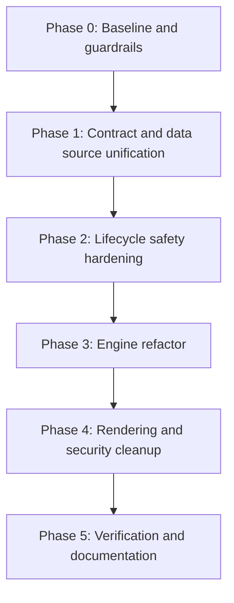

# Battlesim Replay Improvement Plan

## Goal

Stabilize the replay system, make the client/server contract consistent, and reduce the amount of imperative logic tied directly to the React render tree.

Primary scope references:

- `apps/web/src/app/battlesim/replay/page.tsx`
- `apps/web/src/app/battlesim/replay/_components/Game.tsx`
- `apps/web/src/app/battlesim/_hooks/useGameState.tsx`
- `apps/web/src/app/battlesim/_hooks/useBattleFlow.tsx`
- `apps/api/src/api/smartrotom/achievement/achievement.controller.ts`
- `apps/web/src/services/api/smartrotom/achievementsService.ts`

## Priority 1 - Correctness and Safety

1. Fix the replay API contract.
2. Remove hardcoded replay URLs and IDs.
3. Sanitize or replace any `dangerouslySetInnerHTML` replay rendering.
4. Add cleanup for `MutationObserver`, `setTimeout`, and animation promises.

Expected outcome:

- Replay data loads through one predictable path.
- Replay text cannot inject arbitrary HTML into the UI.
- Unmounting or replay resets do not leave background work behind.

## Priority 2 - Architecture

1. Split `Game` into data loader, playback controller, and view shell.
2. Replace the module-level battle store with instance-local state.
3. Precompute replay events once and consume structured actions during playback.
4. Move scene animation coordination behind a small controller interface.

Expected outcome:

- Less coupling between loading, playback, and rendering.
- Fewer rerenders during playback.
- Easier unit testing of the replay engine.

## Priority 3 - UI and Interaction

1. Make the dynamic replay route actually drive the loaded replay.
2. Decide whether the shared replay widget belongs in a route-private folder or a dedicated feature slice.
3. Remove or wire up the unused debugger and prototype files.
4. Improve turn input validation and empty-state handling.

Expected outcome:

- The replay page behaves consistently across all entry points.
- Unused files no longer create maintenance noise.
- User input is safer and more predictable.

## Implementation Phases

### Phase 0 - Guardrails and Baseline (0.5 day)

1. Capture baseline behavior for replay loading and controls (play, pause, next/previous turn, jump to turn).
2. Confirm all current entry points and expected payload shapes.
3. Freeze scope for first pass: no visual redesign, only correctness and stability.

Deliverables:

- Baseline checklist attached to this file.
- Explicit list of supported replay entry paths.

### Phase 1 - Contract and Data Source Unification (1 day)

1. Align client and server replay endpoint contract (method, route, payload shape).
2. Remove hardcoded replay source values from page-level entries.
3. Ensure dynamic route parameters or explicit props determine replay selection.
4. Keep one canonical replay-fetch service path for each domain (achievement or liga).

Deliverables:

- Contract table (request/response) added to audit docs.
- Replay loading works from all active entry points without hardcoded IDs.

### Phase 2 - Lifecycle Safety Hardening (1 day)

1. Add teardown for `MutationObserver` in replay hooks.
2. Add cancellation/cleanup for `setTimeout` playback scheduling.
3. Add cleanup for pending scene animation promises/queues during unmount and restart.
4. Add defensive guards for race conditions when switching turns rapidly.

Deliverables:

- No orphaned observers/timers after unmount.
- Stable behavior under rapid control interaction.

### Phase 3 - Replay Engine Refactor (2 days)

1. Precompute replay lines into a normalized event timeline once.
2. Refactor playback to consume timeline events instead of reparsing each tick.
3. Split `Game` responsibilities into:
   - Data loader container
   - Playback controller
   - Presentation shell
4. Move battle state ownership to instance scope (remove module-level leakage risk).

Deliverables:

- Deterministic event playback path.
- Reduced rerender and parsing overhead.

### Phase 4 - Rendering and Security Cleanup (1 day)

1. Replace unsafe HTML rendering path or sanitize strictly at one boundary.
2. Tighten turn input parsing and invalid-state handling.
3. Remove or archive dead/prototype files (`page2`, unused debugger component) after validation.
4. Keep debug output behind development-only guardrails.

Deliverables:

- No raw unsanitized replay HTML rendering.
- Cleaner replay folder structure.

### Phase 5 - Verification and Documentation (0.5 day)

1. Run lint, unit, and e2e checks for touched apps.
2. Validate replay behavior manually on all supported entry points.
3. Update architectural docs with final data and event flow.

Deliverables:

- Verification evidence attached to task run.
- Updated docs and handoff notes.

## Task Breakdown (Execution Backlog)

### Critical ✅

- ~~C1: Replay API contract alignment (web service + API controller).~~ ✅ Done
- ~~C2: Remove hardcoded replay IDs/URLs from replay route entry files.~~ ✅ Done
- ~~C3: Add hook/animation cleanup for observer + timer + queue lifecycle.~~ ✅ Done
- ~~C4: Eliminate unsanitized replay HTML render path.~~ ✅ Done

### High ✅

- ~~H1: Build one-pass replay timeline parser.~~ ✅ Done
- ~~H2: Refactor playback loop to use normalized timeline.~~ ✅ Done
- ~~H3: Move module-scoped battle state to instance-scoped state.~~ ✅ Done
- ~~H4: Wire dynamic route parameter to actual replay loading behavior.~~ ✅ Done (via C2)

### Medium ✅/⏳

- ~~M1: Remove dead replay artifacts after verification.~~ ✅ Done
- ~~M2: Harden control input validation and error states.~~ ✅ Done
- M3: Reduce rerenders via component boundary cleanup. ⏳ Follow-up

## Week 1 Start Plan

Day 1:

1. Execute C1 and C2 together.
2. Verify `/battlesim/replay`, dynamic replay route, and SmartRotom embed paths.

Day 2:

1. Execute C3.
2. Stress test rapid seek and play/pause interactions.

Day 3:

1. Execute C4.
2. Add safe rendering coverage tests for replay log output.

Exit criteria for Week 1:

- Replay load path is stable and contract-consistent.
- No lifecycle leaks under repeated mounts and rapid controls.
- No unsanitized replay HTML rendered directly.

## Suggested Execution Order

## Milestones

### Milestone 1: Stabilization

- Align client and server replay endpoint names and HTTP methods.
- Replace hardcoded source values with route- or prop-driven inputs.
- Add teardown for observers and animation work.

### Milestone 2: Engine Refactor

- Parse replay logs into a structured timeline.
- Use that timeline for play, pause, and turn jumps.
- Isolate DOM animation logic behind a controller boundary.

### Milestone 3: Cleanup

- Remove dead code and unused debug views.
- Tighten validation and rendering safety.
- Document the final replay data flow for future maintainers.

## Acceptance Criteria

- Replay loading works from every supported entry point.
- No replay path depends on hardcoded external URLs.
- No replay output uses raw HTML injection unless explicitly sanitized.
- All observers, timers, and animation queues are cleaned up on teardown.
- The replay engine can be understood from the documentation alone.

## Risks and Mitigations

1. Risk: Contract changes break SmartRotom consumers.
Mitigation: update shared service calls and validate all known embed paths in the same PR.

2. Risk: Timeline refactor introduces playback drift.
Mitigation: keep old and new playback paths behind a temporary feature flag until parity checks pass.

3. Risk: Cleanup changes break animations mid-turn.
Mitigation: add teardown-safe guards and regression checks for restart/seek flows.

## Working Agreement for Implementation

1. No new hardcoded replay IDs, URLs, or fallback files.
2. No direct API fetches from replay components; use service layer only.
3. Every replay lifecycle effect must return cleanup.
4. Any HTML rendering path must be sanitized or replaced with structured rendering.
